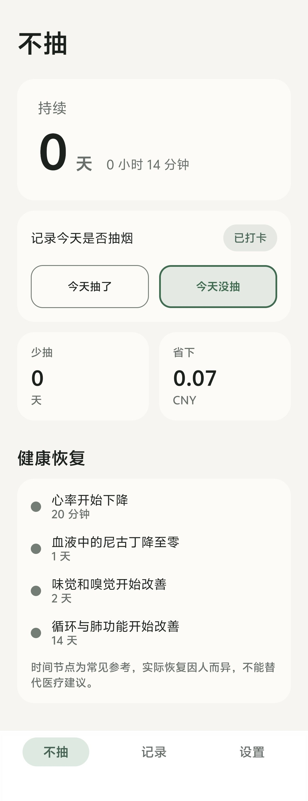
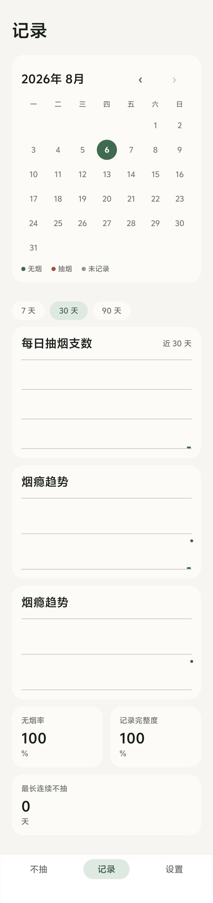
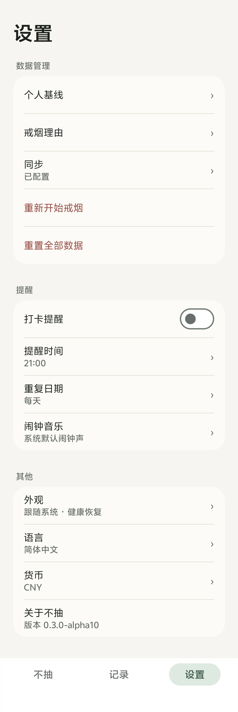
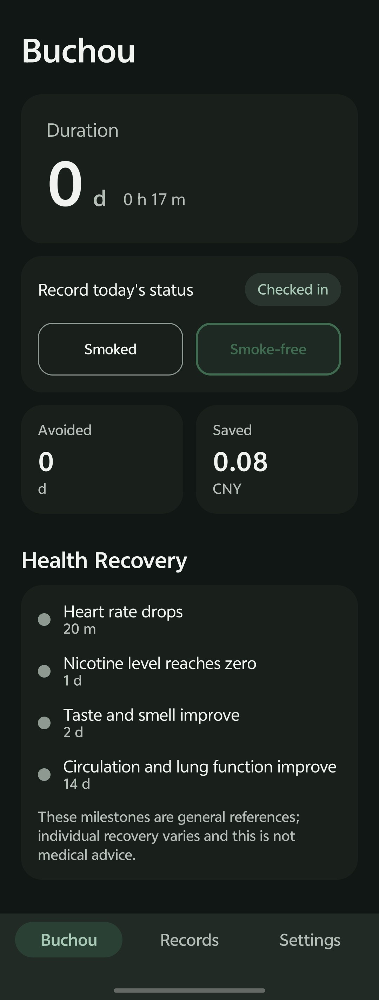
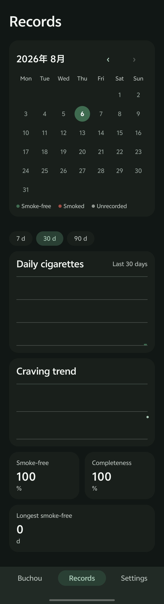
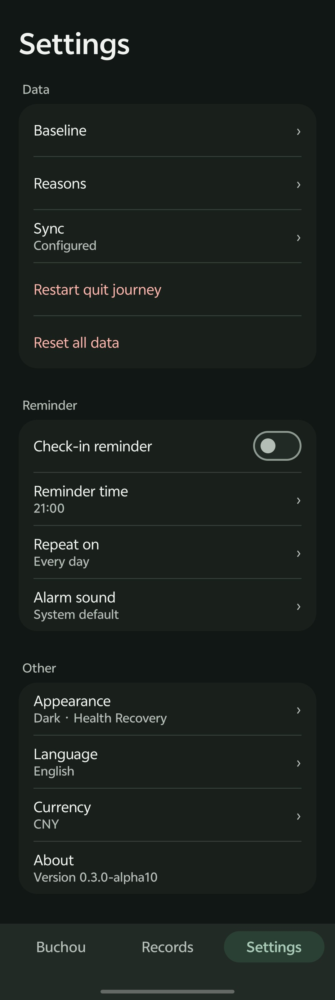

# 不抽 Buchou

本地优先的戒烟记录工具。

帮助你看清当前戒烟状态、诚实记录吸烟行为，通过连续时长、统计反馈、健康恢复节点和成就提供长期支持。

## 界面预览

<table>
  <tr>
    <td valign="top"></td>
    <td valign="top"></td>
    <td valign="top"></td>
  </tr>
    <tr>
    <td valign="top"></td>
    <td valign="top"></td>
    <td valign="top"></td>
  </tr>
  <tr>
    <td align="center">不抽</td>
    <td align="center">记录</td>
    <td align="center">设置</td>
  </tr>
</table>

## 产品特点

- **本地优先**：数据存储在本地，不依赖账号和服务器
- **WebDAV 同步**：支持坚果云等标准 WebDAV 服务，数据自主可控
- **诚实记录**：漏打卡不会重置连续天数，只有记录吸烟才会重置
- **三页面设计**：不抽（打卡）、记录（统计）、设置
- **桌面组件**：三种尺寸（4×2、4×1、2×4），实时显示连续时长和今日状态
- **双语支持**：简体中文 / English
- **深色模式**：支持跟随系统、浅色、深色

## 技术栈

- **语言**：Kotlin
- **UI**：Jetpack Compose + Material 3
- **数据库**：Room
- **桌面组件**：Glance
- **网络**：OkHttp（WebDAV 同步）
- **最低版本**：Android 10（API 29）
- **目标版本**：Android 16（API 36）

## 项目结构

```
android/app/src/main/java/com/buchou/app/
├── BuchouApplication.kt       # Application 入口
├── MainActivity.kt            # 主 Activity
├── AlarmActivity.kt           # 闹钟响铃页面
├── alarm/                     # 提醒闹钟
│   ├── AlarmScheduler.kt
│   ├── AlarmReceiver.kt
│   ├── AlarmRingingService.kt
│   ├── NextAlarmCalculator.kt
│   ├── ReminderSettings.kt
│   └── RescheduleReceiver.kt
├── data/                      # 数据层
│   ├── BuchouRepository.kt
│   ├── BuchouData.kt          # 派生状态
│   └── local/                # Room 数据库
├── domain/                    # 领域层
│   ├── QuitCalculations.kt    # 统计计算
│   └── model/                 # 领域模型
├── sync/                      # WebDAV 同步
│   ├── SyncManager.kt
│   ├── SyncPreferences.kt
│   └── WebDavClient.kt
├── ui/                        # UI 层
│   ├── BuchouApp.kt           # 首页
│   ├── ProductShell.kt       # 记录页、设置页
│   ├── BuchouViewModel.kt
│   ├── components/            # 通用组件
│   └── theme/                 # 设计 Token
└── widget/                    # 桌面组件
    └── BuchouWidget.kt
```

## 构建

```bash
cd android
./gradlew assembleDebug
```

APK 输出路径：`android/app/build/outputs/apk/debug/app-debug.apk`

## 测试

```bash
cd android
./gradlew testDebugUnitTest
```

## 文档

- [产品规格](docs/PRODUCT_SPEC.md)
- [状态模型](docs/STATE_MODEL.md)
- [设计系统](docs/DESIGN_SYSTEM.md)
- [实施计划](docs/IMPLEMENTATION_PLAN.md)

## 开源许可

MIT License
